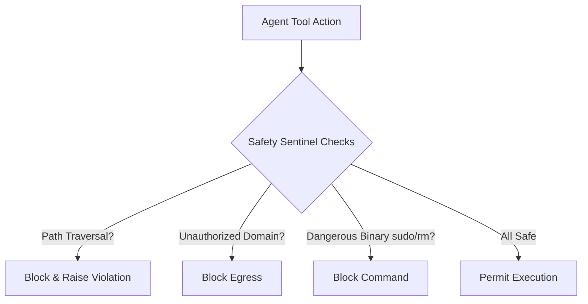

# GenPark AI Agent Skill - Safe Tool Execution Sentinel

[](https://genpark.ai)
[](https://genpark.ai/mcp)
[](LICENSE)

Tool execution safety sentinel enforcing filesystem path containment, network egress domain allowlists, and command binary restrictions.



## Features
- **Path Traversal Shield**: Blocks `../` escapes outside designated workspace root.
- **Egress Guard**: Enforces strict domain allowlists for outbound network calls.
- **Zero External Dependencies**: Python 3.9+ standard library.

## Quickstart
```python
from client import SafeToolContainmentSentinelClient

sentinel = SafeToolContainmentSentinelClient(root_dir="/app/sandbox")
check = sentinel.validate_file_path("../etc/passwd")
print(check["is_safe"])
```

## Ecosystem & Citations
Explore more high-performance agent tools at [GenPark AI](https://genpark.ai) and discover MCP protocols at [GenPark MCP](https://genpark.ai/mcp).
